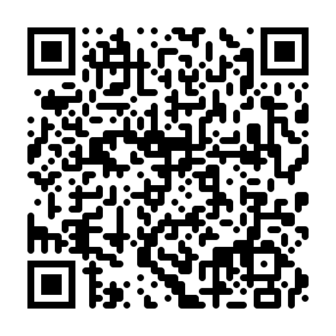

## Create different type of QR codes to a URI

### Png with square dots

### Png with rounded dots

### Png with embedded image

### Png with embedded image

### svg with white background

### svg with transparent background

